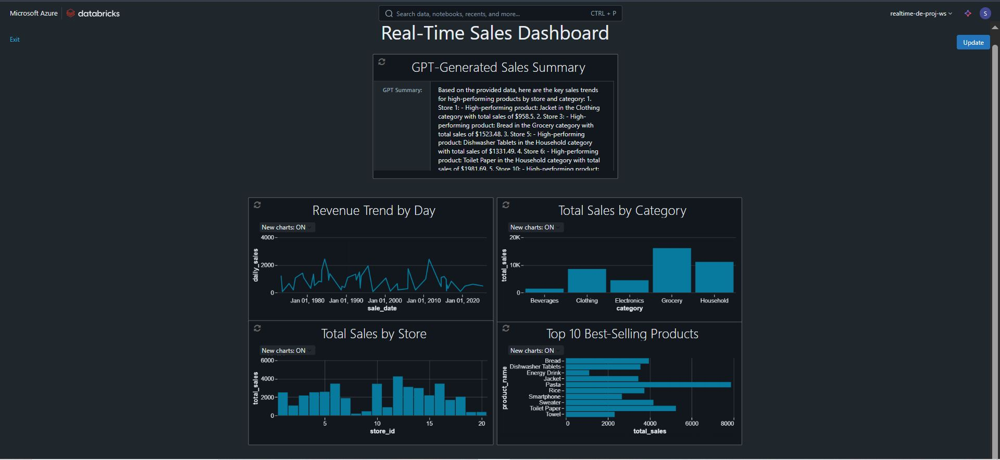
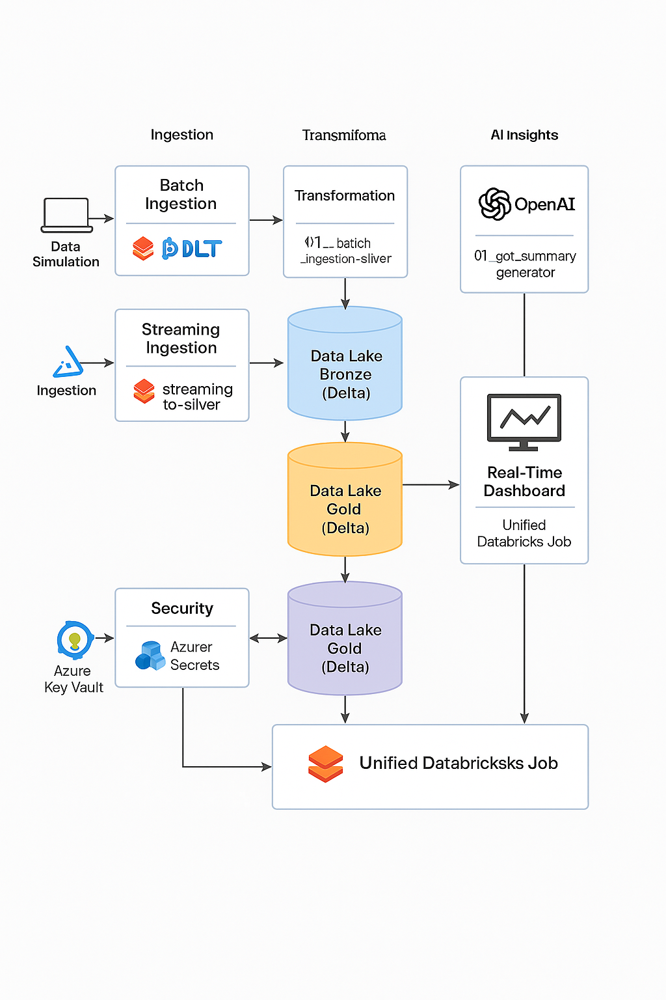
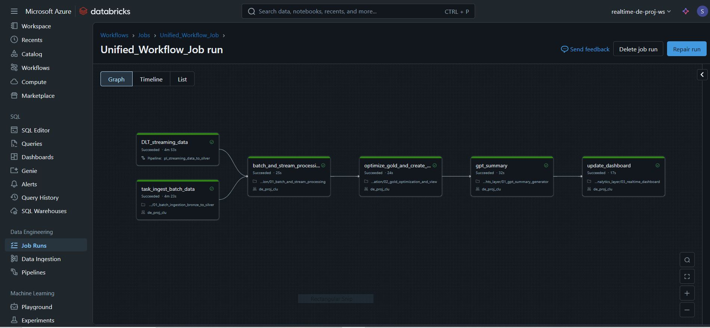
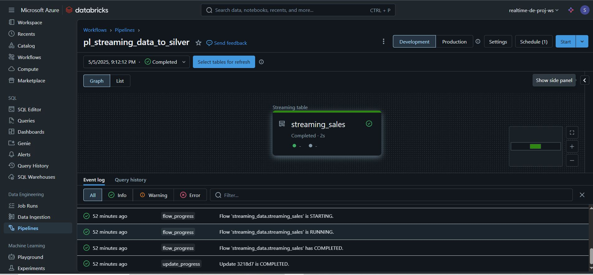

# ⚡ Real-Time AI-Powered Data Engineering Pipeline with Databricks & GPT

This open-source project showcases a **real-time, AI-enhanced data pipeline** built using the **modern Lakehouse architecture** on **Azure Databricks**. It simulates both **batch and streaming data**, processes it through **Bronze → Silver → Gold layers**, integrates **OpenAI’s GPT** to generate smart sales summaries, and finally renders everything in a live **Databricks dashboard**.

> 🚀 Perfect for showcasing Data Engineering, Streaming, GPT Integration, Secure Azure Mounting, and End-to-End Workflow Orchestration skills — just like what modern data teams at tech-forward companies need.

---

## 💡 What You'll See in This Project



- 🔁 **Real-Time Streaming + Batch Ingestion** using Parquet & Delta formats
- 🧹 **Dirty Data Cleansing & Schema Enforcement**
- 🪙 **Bronze → Silver → Gold Lakehouse Layers** with structured processing
- 🤖 **AI-Driven GPT Summaries** generated from Gold data
- 📊 **Real-Time Sales Dashboard** inside Databricks
- 🔐 **Enterprise-Grade Security** with Azure Key Vault + Secret Scopes
- 📈 **Fully Orchestrated Pipeline** using Databricks Jobs + Delta Live Tables (DLT)

---

## 🧱 Project Architecture

This project follows a modern **Lakehouse + AI design pattern** built on Databricks and Azure. Here's the high-level architecture:

- 🔄 **Data Simulation**: Generates both batch and streaming Parquet files
- 🧪 **Ingestion Layer**:
  - Batch → Ingested via PySpark notebooks to Silver layer
  - Streaming → Ingested using **Delta Live Tables (DLT)** and stored in Silver
- 🧹 **Transformation Layer**: 
  - Cleansed, validated, enriched in Silver
  - Processed into Gold with analytics-ready columns
- 🤖 **AI Insights Layer**: 
  - Uses **OpenAI GPT-3.5** to summarize Gold data into natural language insights
- 📊 **Visualization Layer**:
  - Real-time Databricks dashboard (sales trends, categories, GPT summary)
- 🔐 **Security Layer**:
  - Azure Key Vault + Secret Scopes for secure mounting and key management
- ⚙️ **Orchestration**:
  - A Unified Databricks Job manages batch, streaming, AI, and dashboard end-to-end

---

### 📌 Architecture Diagram



---

## 🌟 Key Features

This project showcases the most in-demand, real-world features companies expect from modern data engineers:

### ⚙️ Hybrid Ingestion Layer
- 🔄 Simulates **both batch and streaming data**
- ⬅️ Batch data is ingested using PySpark and stored in Bronze (Parquet)
- 🌊 Streaming data is ingested using **Delta Live Tables (DLT)**

### 🧹 Multi-Layer Lakehouse Architecture (Bronze → Silver → Gold)
- 💾 Raw → Cleaned → Enriched data flow using **Delta format**
- 🧠 Gold layer includes reporting-specific columns (total revenue, year/month/day)

### 🧠 AI-Driven Insight Generation
- 🤖 Uses **OpenAI GPT-3.5** to auto-generate sales summaries from Gold layer
- 🔐 API key is secured with **Azure Key Vault + Databricks Secret Scope**
- 💬 Summaries saved to Delta table for real-time dashboard embedding

### 📊 Real-Time Analytics Dashboard
- 📉 Databricks SQL dashboard with:
  - Revenue trends over time
  - Sales by category and store
  - Top 10 best-selling products
  - 🧠 GPT-generated sales summary box

### 🔐 Enterprise-Grade Security
- 🔑 OAuth-based mounting via **Azure Key Vault**
- 🧾 Secret scopes hide all credentials and tokens

### 🧩 End-to-End Orchestration
- 🔁 Unified **Databricks Job** executes entire workflow:
  - Batch ingestion
  - Streaming pipeline (DLT)
  - Silver → Gold → GPT → Dashboard
- 🔄 Can be **scheduled or triggered** on demand

---

## 📒 Notebooks Used in the Pipeline

Below are the core notebooks used in the **Unified Workflow Job** — each playing a specific role in ingestion, transformation, AI, and analytics.

| 📓 Notebook | 📂 Path | ⚙️ Description |
|------------|---------|----------------|
| `01_streaming_to_silver` | [auto_ingestion_layer/01_streaming_to_silver](real_time_ai_de_project/auto_ingestion_layer/01_streaming_to_silver.ipynb) | Streaming sales ingestion via **DLT**, saves to Silver layer |
| `01_batch_ingestion_bronze_to_silver` | [`03_data_ingestion/01_batch_ingestion_bronze_to_silver`](real_time_ai_de_project/03_data_ingestion/01_batch_ingestion_bronze_to_silver.ipynb) | Ingests and transforms batch data (products, stores, promos, sales) to Silver |
| `01_batch_and_stream_processing` | [`real_time_ai_de_project/01_batch_and_stream_processing`](real_time_ai_de_project/04_gold_layer_creation/01_batch_and_stream_processing.ipynb) | Joins batch & stream Silver data → builds enriched Gold table |
| `02_gold_optimization_and_view` | [`04_gold_layer_creation/02_gold_optimization_and_view`](real_time_ai_de_project/04_gold_layer_creation/02_gold_optimization_and_view.ipynb) | Optimizes Gold layer and prepares SQL views |
| `01_gpt_summary_generator` | [`05_ai_insights_layer/01_gpt_summary_generator`](real_time_ai_de_project/05_ai_insights_layer/01_gpt_summary_generator.ipynb) | Generates GPT summary from Gold layer using OpenAI API |
| `03_realtime_dashboard` | [`analytics_layer/03_realtime_dashboard`](real_time_ai_de_project/analytics_layer/03_realtime_dashboard.ipynb) | Builds real-time Databricks dashboard (charts + GPT summary) |

---

### 🛠️ Additional Notebook

| 📓 Notebook | 📂 Path | ⚙️ Description |
|------------|---------|----------------|
| `01_env_config` | [`real_time_ai_de_project/01_env_config`](real_time_ai_de_project/01_env_config.ipynb) | Mounts ADLS containers securely using **Azure Key Vault + OAuth** |

> 🧪 **Note:** Other notebooks in the repo are for testing/debugging only — not part of the production pipeline.


---

## 🔐 Secure Access with Azure Key Vault

This project follows security best practices by using **Azure Key Vault** + **Databricks Secret Scopes** to avoid hardcoding any secrets.

### ✅ What We Secured

| 🔑 Secret | 🔒 Stored In | 🔍 Used For |
|-----------|--------------|-------------|
| `adls-client-secret` | Azure Key Vault | Mounting ADLS Gen2 containers securely via OAuth |
| `open-ai-api-key` | Azure Key Vault | Authenticating GPT-3.5 API for AI summaries |

---

### 🧭 How It Works

1. **Azure Key Vault** holds all sensitive secrets
2. A **Databricks Secret Scope** is configured to connect to the Key Vault
3. Secrets are retrieved securely in notebooks via:
```python   
dbutils.secrets.get(scope="adls_scope", key="adls-client-secret")

```
---

## 🧩 Workflow Orchestration: Databricks Jobs + DLT

This project is orchestrated using a **Unified Databricks Job** that coordinates batch, streaming, AI, and dashboard tasks in sequence — just like an enterprise-grade data platform.

### 📌 Job: `Unified_Workflow_Job`


This job runs 6 key notebooks in order:

1. `DLT_streaming_data` → Triggers DLT pipeline (`pl_streaming_data_to_silver`)
2. `task_ingest_batch_data` → Ingests batch files to Silver
3. `batch_and_stream_processing` → Joins batch + stream data → writes to Gold
4. `optimize_gold_and_create_view` → Optimizes Gold & builds view for SQL/GPT
5. `gpt_summary` → Sends query results to GPT-3.5 and stores natural language insights
6. `update_dashboard` → Final dashboard update using latest data + GPT summary

📍 You can find the job here:  
[`job_definitions/Unified_Workflow_Job`](job_definitions/unified_workflow_job.json)

---

### 🔁 DLT Pipeline: `pl_streaming_data_to_silver`


This Delta Live Tables (DLT) pipeline is responsible for:

- Auto-ingesting streaming sales transactions
- Cleaning, validating, deduplicating
- Writing clean output to the **Silver layer**

📍 Defined inside:  
[`auto_ingestion_layer/01_streaming_to_silver`](real_time_ai_de_project/auto_ingestion_layer/01_streaming_to_silver.ipynb)

📍 Pipeline definition:  
[`dlt_pipeline/pl_streaming_data_to_silver`](dlt_pipeline)

---

> ✅ This fully automated workflow mimics how real-time pipelines are deployed at scale in top tech/data teams.


